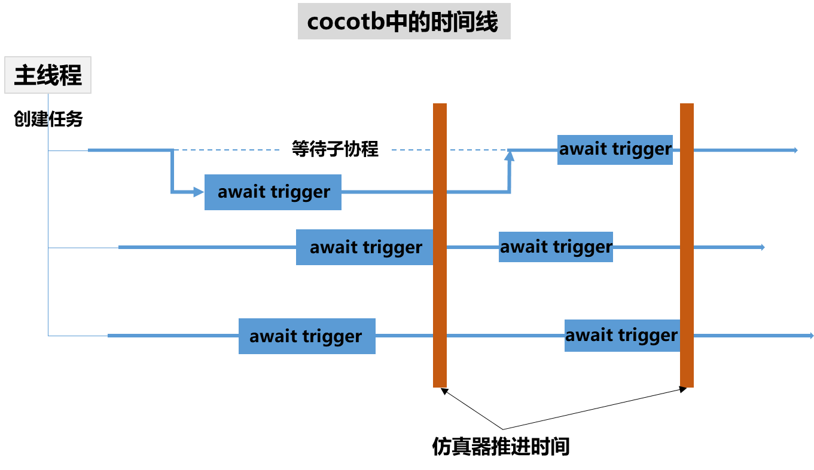

### cocotb中的时间线

从名字上看，cocotb（COroutine based COsimulation TestBench）是基于协程的，由此获得并发控制能力，实现如单独启动一个后台协程去驱动生成时钟信号、创建后台协程监听是否有输入流量等，对于实现一个较为复杂的验证程序而言，多协程几乎是必需的。多协程将带来一定的时间线的混乱，是本文将讨论的问题。

#### 基本知识回顾

协程是一个相对于线程更轻量的概念，在python中线程的实现是由操作系统（OS）实现的，创建线程是调用OS的接口来实现，调度也由OS负责。不过由于GIL的存在，往往多线程程序也只有一个线程是活跃的。对比协程是由python解释器来控制和调度。一般地，协程在单线程上下文中运行，是一种并发，而不是并行。如，用asyncio管理的协程及其事件循环，是在单线程中实现的。当然，这仅是举例，并不意味着cocotb使用了asyncio，事实上，cocotb有自己实现的事件循环（参考：https://github.com/cocotb/cocotb/discussions/3141）。

当使用async修饰函数后，该函数的调用将不会马上实际执行，而是返回一个[协程](https://docs.python.org/3/glossary.html#term-coroutine)对象，具体的执行还要等到它被await或者是被创建形成任务。创建任务使用cocotb.start_soon。对于最外层的async函数，当被cocotb.test()注解后，则将会被自动（依次）调用。

#### 主线任务

cocotb的目标是用python来编写tb文件，并不是替代仿真器（Simulator）。整个仿真过程仍然是在仿真器中推进的（如前文举例的vsim.exe)。仿真过程中会与python代码交互，从中获得输入信号，并将输出传递给Python代码处理。由于一部分运行在仿真器中，一部分运行在python中，这里会涉及两种时间：仿真时间和python执行时间。我们最关心的是仿真时间，随着仿真时间的推移，各类信号的变化情况是期望得到的仿真结果，这是仿真的主线任务。至于python执行时间，则是仿真计算过程所需要的时间，它会影响仿真结果生成的快慢，甚至会由于机器配置不同而效率不同，但不会也不应该影响仿真结果本身的内容。

#### 仿真器与python的交互

如cocotb文档中的整体架构图所示：


执行程序在仿真器和python代码之间**轮流**切换，利用仿真器对[PLI](https://www.asic-world.com/verilog/pli1.html#Introduction)（Programming Language Interface）的支持，python代码（更确切地说是其外围的c代码）向仿真器注册事件函数，并在事件触发时进行响应，在python代码中处理当前仿真的状态（此时已不再推进仿真时间），进而产生新的激励信号，通过调用await trigger后再度回到仿真器的主线任务。这里的trigger是cocotb定义的特定事件。python代码为编程方便，允许使用多协程并发。当且仅当所有协程（或其正在等待的子协程）都处于await trigger的状态后，才再度回到仿真器。也就是说，python端各协程的处理时间长度和先后顺序只要本身代码没有特殊相互依赖关系，那么将不会影响返回仿真器的时机。



#### cocotb中的trigger

cocotb中的trigger包含以下4种：

* 信号类

  * 上升沿（cocotb.triggers.RisingEdge）
  * 下降沿（cocotb.triggers.FallingEdge）
  * 上升沿或下降沿（cocotb.triggers.Edge）
  * N个时钟（cocotb.triggers.ClockCycles)，其实也不一定要是时钟信号，可以是普通信号的多次转换
  
* 时间类
  * 定时器（cocotb.triggers.Timer）
  * 下一个时间刻度（cocotb.triggers.NextTimeStep)
  * cocotb.triggers.ReadWrite，当前时间点的ReadWrite状态，具体见下一节说明
  * cocotb.triggers.ReadOnly，当前时间点的ReadOnly状态，具体见下一节说明
  
* Python类
  * cocotb.triggers.Combine，所有trigger全发生后触发
  * cocotb.triggers.First，任意一个发生后触发
  * cocotb.triggers.Join，任务完成后触发
  
* 同步类，并不是仿真器实际发生的真实事件，而是主要用于协程间同步的虚拟事件

  * cocotb.triggers.Event，用户定义的事件，用于协程间等待和唤醒

  * cocotb.triggers.Lock，加锁

  * cocotb.triggers.with_timeout，在一定时间内等待任务或trigger

参考：https://docs.cocotb.org/en/stable/triggers.html

#### 时间点内的时间线

整个仿真时间轴上的一个点，尽管在一般看来它是瞬时点位，而不具有持续时间的概念，但实际上在cocotb中，也仍然有4种状态的依次转移，只是我们需要把这些转移视为瞬发完成的。理解这4种状态，对于完成仿真并不一定必要，但由于不同trigger发生于不同的状态阶段，在获取信号值时，有时需特别对待。

4种状态分别是：

```
Beginning of Time Step ---> Value Change ---> Values Settle ---> End of Time Step
                            ^                            /
                             \__________________________/
```

不同的trigger发生的状态阶段如下：

* [`NextTimeStep`](https://github.com/cocotb/cocotb/wiki/Timing-Model#nexttimestep) trigger to move you to the [beginning of the next time step](https://github.com/cocotb/cocotb/wiki/Timing-Model#beginning-of-time-step).
* [`Timer`](https://github.com/cocotb/cocotb/wiki/Timing-Model#timer) to move to the [beginning of any following time step](https://github.com/cocotb/cocotb/wiki/Timing-Model#beginning-of-time-step).
* [`Edge`, `RisingEdge`, or `FallingEdge`](https://github.com/cocotb/cocotb/wiki/Timing-Model#edge--risingedge--fallingedge) to move you to the next [value change](https://github.com/cocotb/cocotb/wiki/Timing-Model#value-change) state where the requested value changes.
* [`ReadWrite`](https://github.com/cocotb/cocotb/wiki/Timing-Model#readwrite) to move to the [end of the first delta cycle](https://github.com/cocotb/cocotb/wiki/Timing-Model#values-settle).
* [`ReadOnly`](https://github.com/cocotb/cocotb/wiki/Timing-Model#readonly) to move to the [end of the current time step](https://github.com/cocotb/cocotb/wiki/Timing-Model#end-of-time-step).

几点说明：

* Timer发生于Timestep的起始阶段，如果此时改变某信号的值，并紧随一个针对该信号的await Edge/FallingEdge/RisingEdge，那么其实这两个事件发生在同一个时间点位
* 对某信号的await Edge/FallingEdge/RisingEdge只能保证该信号的值完成了切换，却不能保证在这一时间点上其他信号也完成了切换，对A信号await Edge/FallingEdge/RisingEdge后，去取B信号的值，有概率读取信号改变前或改变后的值（尽管实际电路中其他信号的改变相对于时钟信号边沿总是有一定量的偏移，但在仿真中不排除同时发生的可能），这可能给处理函数带来一定的混乱。所以，如果想读到一个稳定的值，那应该在await Edge/FallingEdge/RisingEdge后紧跟一个await ReadOnly，这样能保证所有信号都完成了数据变更。

参考：https://github.com/cocotb/cocotb/wiki/Timing-Model
